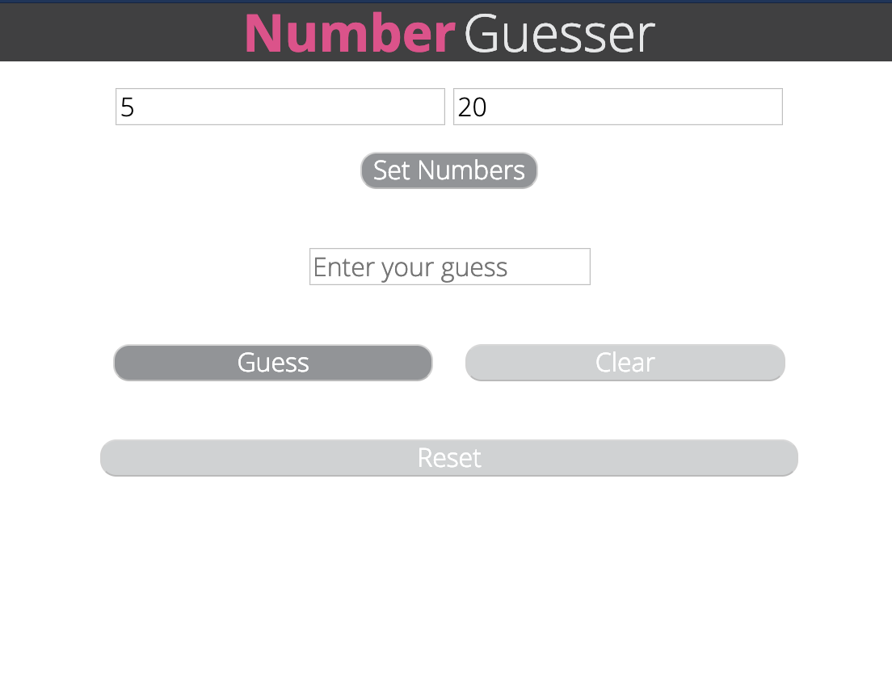
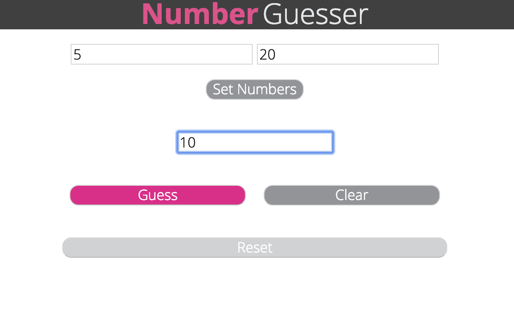
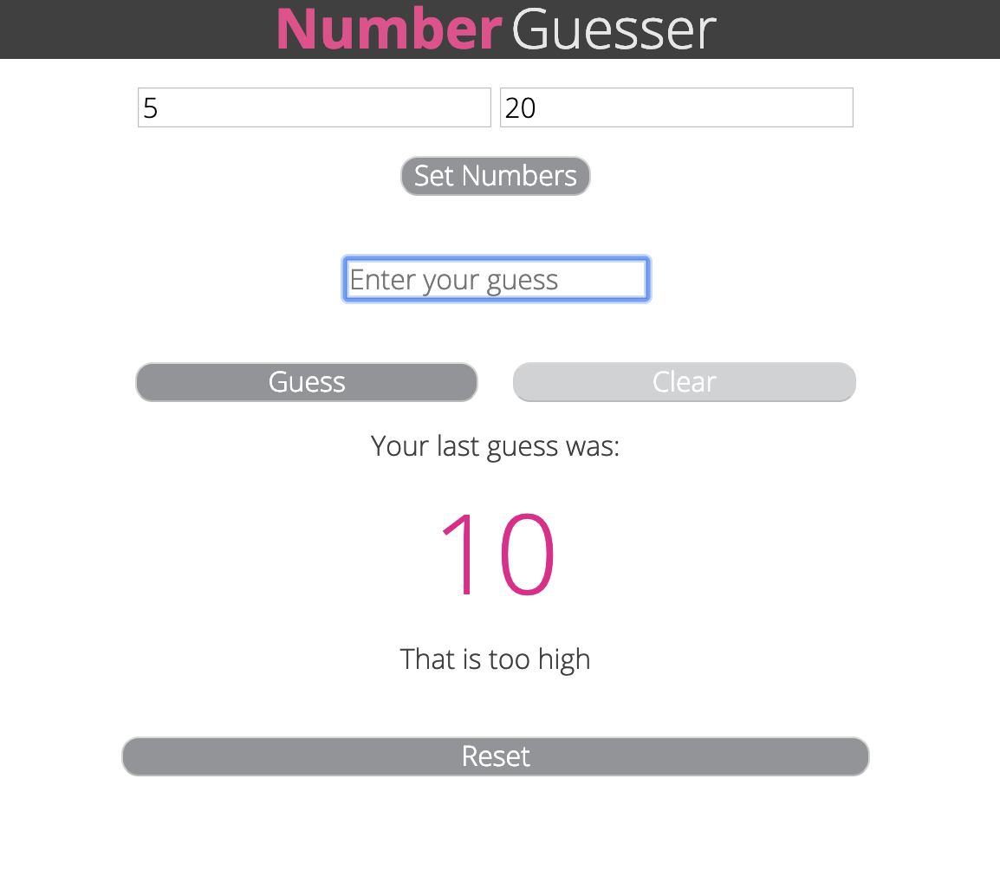
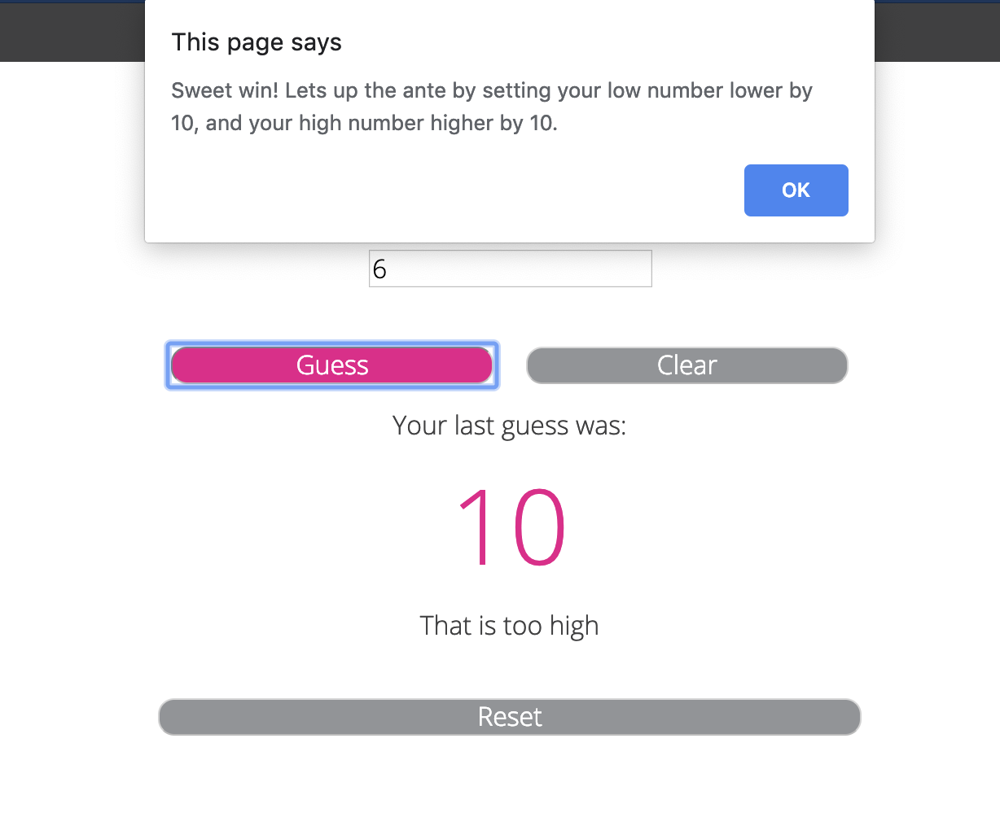

# Number Guesser
A Turing School solo project created with Html, JavaScript, and CSS.


Contributors:
* Bradley Niedt


# About Number Guesser

Number Guesser is a one-page number guessing game built with Html, JavaScript, and CSS. It allows the user to enter a range of numbers to guess within, and when the user guesses correctly, it ups the ante by making the range larger.


## Getting Started

### Clone down

* `git clone https://github.com/Bradniedt/number_guesser.git`
* `cd number_guesser`
* To run the game:

```
open index.html
```


## Playing the game:

* Enter a low number and a high number, and click on the button labeled "Set Numbers"



* Enter a guess into the input that says "Enter your guess", and click "guess"



* The game will tell you if your guess was too low, too high, or correct.



* When you guess correctly, the game will show an alert, and will set the range of numbers to be wider.



* If you want to clear your guess before submitting, you can click the "clear" button.

* If you'd like to reset the game to have a new range, press the "reset" button, and enter new numbers.


## Created with

* HTML
* JavaScript
* CSS
